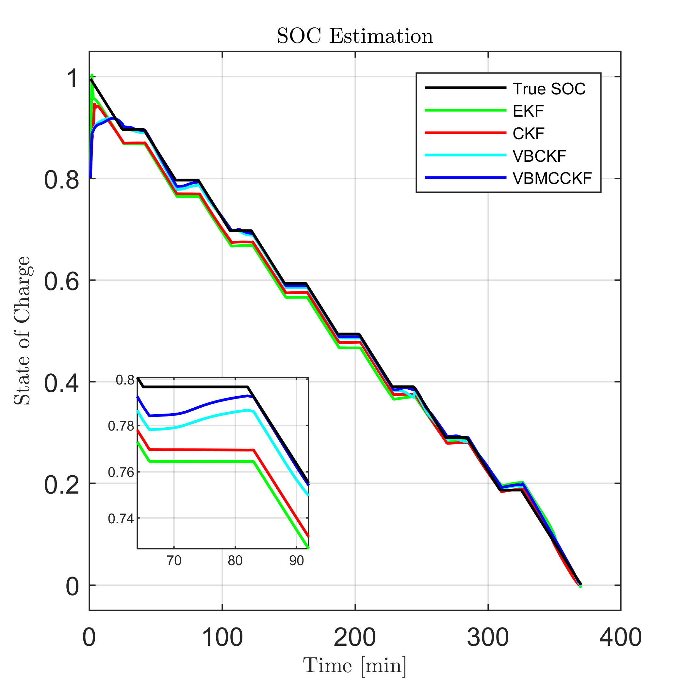
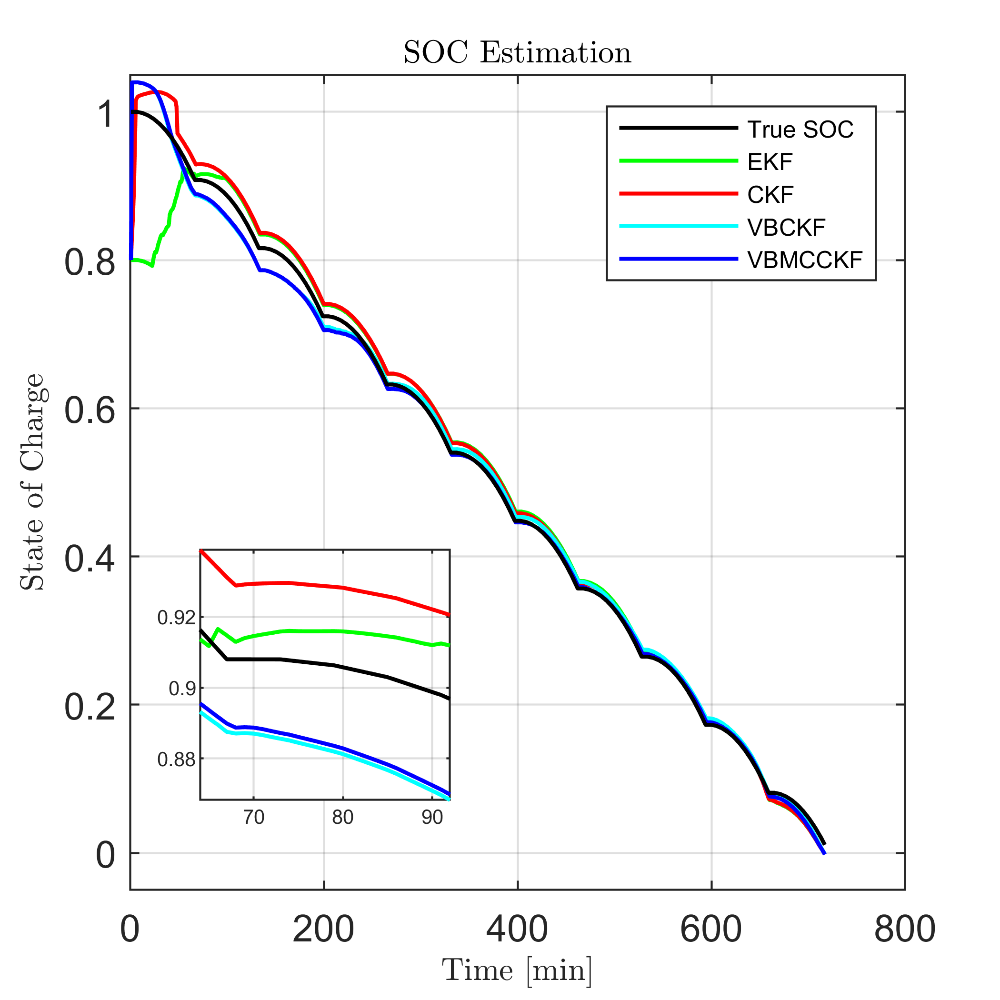
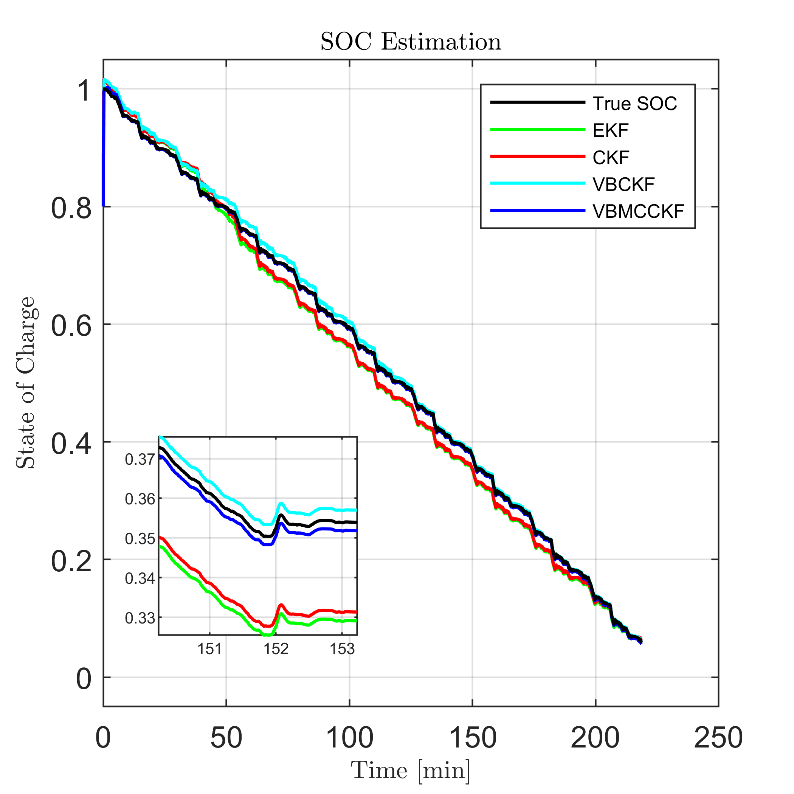
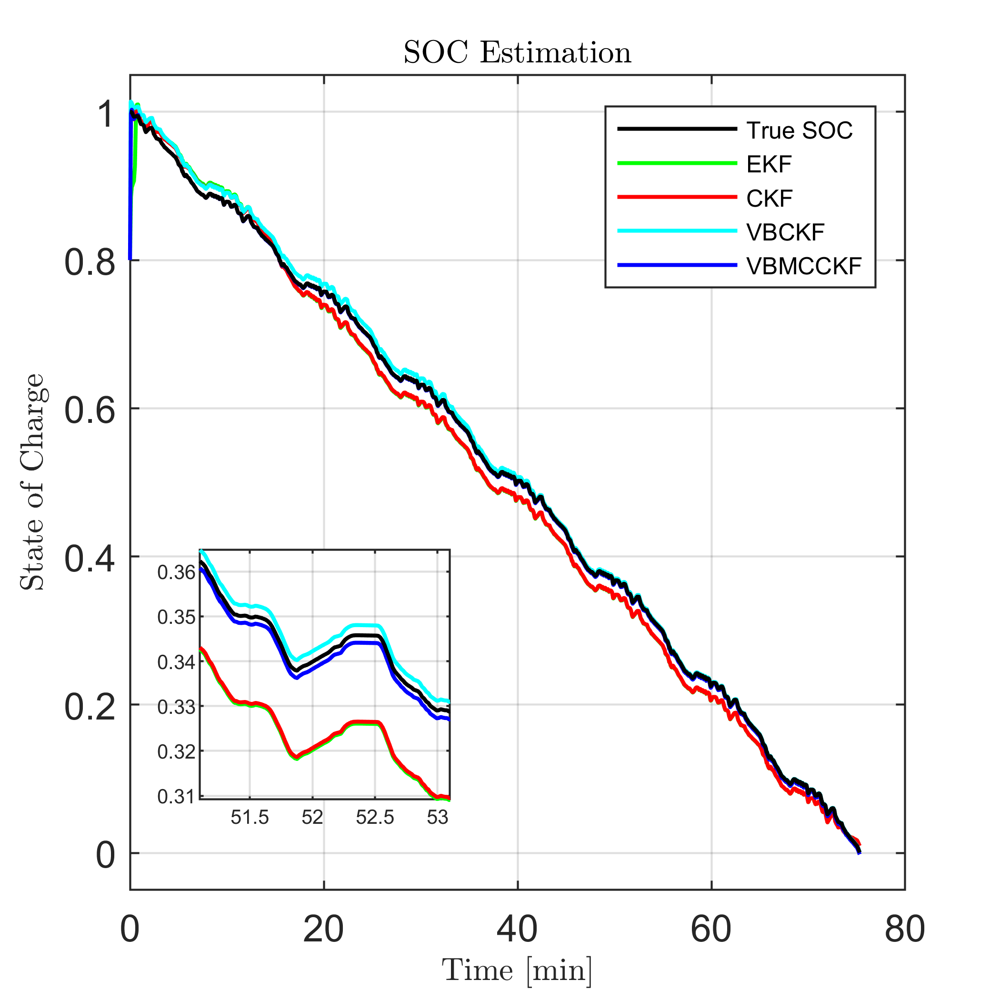

# VBMCCKF SOC Estimation (MATLAB)

MATLAB code, data, and figures for the four datasets used in the VBMCCKF SOC estimation paper. Each dataset folder is self-contained with scripts, .mat data, and generated plots.

## Contents

- `0_paper/` PDF of the published paper.
- `1_ConstPulse_Disch/` constant pulse discharge dataset and scripts.
- `2_VariablePulseDisch/` variable pulse discharge dataset and scripts.
- `3_LA92_Disch/` LA92 drive cycle discharge dataset and scripts.
- `4_US06_Disch/` US06 drive cycle discharge dataset and scripts.

Each dataset folder includes:
- MATLAB scripts (`main.m`, `T1_EKF_Main.m`, `T2_CKF_Main.m`, `T3_VBCKF_Main.m`, `T4_VMCCKF_Main.m`).
- `.mat` files for model/data tables and results.
- Figure outputs (`.fig`, `.png`, `.jpg`) from the runs.
- `SOC - data/` raw data spreadsheets (`.xlsx`).
- `slprj/` Simulink generated cache (safe to ignore).

## How to run

1. Open MATLAB.
2. Change into a dataset folder, for example:

   ```matlab
   cd('1_ConstPulse_Disch')
   ```

3. Run the main script:

   ```matlab
   main
   ```

4. Or run a specific filter:

   ```matlab
   T1_EKF_Main
   T2_CKF_Main
   T3_VBCKF_Main
   T4_VMCCKF_Main
   ```

Figures are saved in the same folder as the scripts.

## Results preview

Examples of SOC estimation results from each dataset:

<p>
  
</p>
<p>
  
</p>
<p>
  
</p>
<p>
  
</p>

## Paper

I. Hafez, A. Wadi, M. F. Abdel Hafez, and A. A. Hussein,  
"Variational Bayesian Based Maximum Correntropy Cubature Kalman Filter Method for State of Charge Estimation of Li Ion Battery Cells,"  
IEEE Transactions on Vehicular Technology, vol. 72, no. 3, pp. 3090-3104, 2023.  
doi: 10.1109/TVT.2022.3216337.
